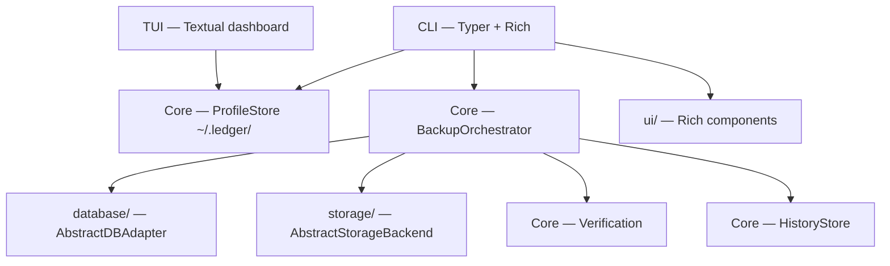

# Architecture

Ledger is a **layered plugin system** with **Docker-level UX**. The CLI calls the engine; the engine calls database adapters. Everything is profile-driven — no 50 flags.

## Layer diagram



## Package layout

All packages live under `src/` (see [src/README.md](../src/README.md)):

```text
src/
├── cli/          # init, backup, restore, profiles, backups, dashboard
├── core/         # orchestrator, scheduler, profiles, history, verification
├── database/     # PostgreSQL, MySQL, MongoDB, SQLite adapters
├── storage/      # local, S3, GCS, Azure
├── ui/           # Rich banner, progress, tables
├── tui/          # Textual dashboard
└── utils/        # models, exceptions, compression, encryption, logging
```

## Profile-first UX

```bash
ledger init              # wizard → ~/.ledger/profiles/<name>.yaml
ledger backup postgres-prod
```

Profiles bundle database + storage + compression settings. Passwords come from env vars or keyring — never from YAML.

## Rich terminal UI

| Component | Module | Purpose |
|---|---|---|
| Banner | `ui/banner.py` | Branded header panels |
| Progress | `ui/progress.py` | Dump / compress / upload / verify stages |
| Tables | `ui/tables.py` | Profiles, backup explorer |
| Dashboard | `tui/app.py` | Textual full-screen UI |

## Exception hierarchy

```text
LedgerError
├── ConnectionError
├── BackupError
├── StorageError
├── RestoreError
├── ConfigError
├── EncryptionError
└── SchedulerError
```

## Core design decisions

Unchanged from the engine layer — subprocess streaming, atomic writes, 8 MB chunks, timestamp filenames. See [deployment.md](deployment.md) for production constraints.
