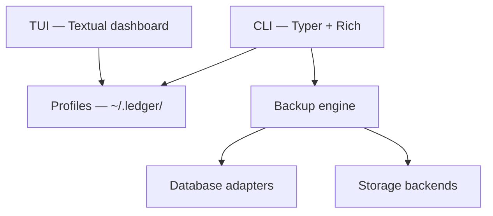

# How Ledger Works

Ledger is a layered CLI tool: you interact through commands and profiles; the engine handles adapters, compression, encryption, and storage behind abstract interfaces.

## At a glance



## Profile-first design

You never pass connection strings on the command line. A **profile** bundles:

- Database type, host, port, database name
- Storage target (local, S3, GCS, Azure)
- Compression and encryption preferences

```bash
ledger init                    # creates ~/.ledger/profiles/<name>.yaml
ledger backup postgres-prod    # loads profile, runs pipeline
```

Passwords and API keys are read from environment variables (`LEDGER_*`) or keyring — never stored in profile files.

## Backup pipeline

```text
database adapter → compress → encrypt (optional) → storage → verify → history.db
```

- **Streaming** — 8 MB chunks; memory stays flat on large databases
- **Atomic writes** — `.tmp` then rename; no corrupt partial files
- **Timestamped artifacts** — `mydb_full_20240608T142301Z.sql.gz`; never overwritten

## Supported backends

| Layer | Options |
|---|---|
| Databases | PostgreSQL, MySQL, MongoDB, SQLite |
| Compression | gzip (default), bz2, lzma |
| Storage | Local, S3, GCS, Azure Blob |
| Encryption | AES-256-GCM (optional) |

## Data on disk

```text
~/.ledger/
├── profiles/       # YAML profile files
├── storage/        # local backup artifacts
├── history.db      # backup explorer index
└── logs/
```

## For maintainers

Internal package layout lives under `src/` — see [src/README.md](../src/README.md) if you're contributing to the CLI.
